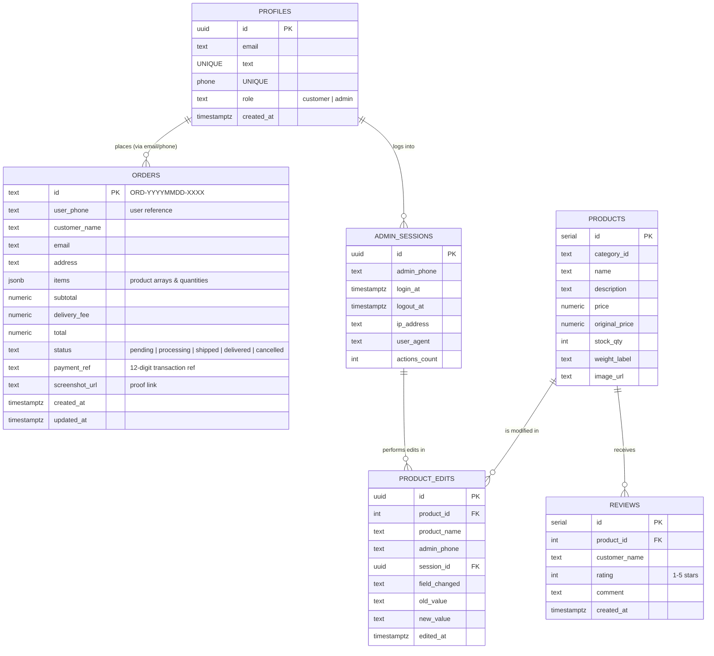

# SpiceKraft: Modern Real-Time E-Commerce Platform
### Freelance Portfolio & Project Documentation

SpiceKraft is a premium, full-stack, real-time e-commerce application designed for seamless customer shopping experiences and powerful administrative management. Built using a modern React frontend and a robust serverless Supabase backend, the platform is engineered for visual excellence, performance, and reliability.

---

## 🚀 Key Highlights & Selling Points (For Portfolio Showcase)

*   **Real-time Synchronization:** Built-in Postgres replication pushes live updates to the admin dashboard for orders and inventory modifications.
*   **Secure Payment Proof & UPI Flow:** Includes offline-to-online UPI routing, generating dynamic QR codes, handling auto-redirects, and storing administrative screenshot verifications.
*   **Enterprise-Grade Auditing:** Fully-fledged admin audit logs track every login session, active duration, and precise product modifications (original vs. new values).
*   **Polished User Experience:** Utilizes modern typography, fluid grid architectures, custom state animations via Framer Motion, and comprehensive dark/light theme options.
*   **Robust Backend Security:** Configured using clean Supabase migrations with custom constraints, relational integrity, and cascade rules.

---

## 🛠️ Technology Stack & Tooling

The application leverages state-of-the-art tools and libraries across the development lifecycle:

| Layer | Technology | Purpose |
| :--- | :--- | :--- |
| **Frontend Core** | React 18 & TypeScript | Type-safe declarative UI structure, reusable components, and high-performance client rendering. |
| **Build & Tooling** | Vite 6 | Lightning-fast development server, hot module replacement, and optimized production builds. |
| **Styling** | Tailwind CSS v4 & Vanilla CSS | Modern, utility-first layouts, responsive grids, and design tokens for dark/light themes. |
| **Database & Backend** | Supabase (Postgres) | Hosted relational database with built-in Auth, Realtime Channels, and secure Storage buckets. |
| **Animations** | Motion (Framer Motion) | Micro-interactions, page transition states, and modal/drawer slide-ins. |
| **Data Visualization**| Recharts | Interactive SVG analytics graphs for admin revenue tracking, order states, and sales velocity. |
| **State & Navigation** | React Router 7, Context API | Client-side routing, query-driven navigation, global Authentication & Cart state management. |
| **UI Components** | Radix UI & Material Icons | Accessible primitives (dialogs, select, tabs, accordions) with high visual polish. |

---

## 💡 System Functionalities

### 1. Customer Shopping Experience
*   **Dynamic Landing Page:** Features categorized banners, trending product carousels, customer reviews, and responsive navigation headers.
*   **Intuitive Category & Filter Flow:** Customers can filter spices and products dynamically, checking real-time stock indicators.
*   **Persistent Cart Management:** Add, edit, or remove items with real-time recalculation of subtotals, shipping, and local taxes (CGST/SGST).
*   **Interactive Payment Gateways:**
    *   Dynamic generation of UPI payment QR codes.
    *   Direct deep-linking/UPI redirect capability for mobile devices.
    *   Secure form fields allowing customers to upload transaction screenshots and enter their 12-digit transaction reference IDs.
*   **Customer Order History:** Authenticated tracking of previous orders with real-time delivery progress tags (`pending`, `processing`, `shipped`, `delivered`, `cancelled`).

### 2. Administrative Control & Analytics
*   **Real-Time Admin Dashboard:** High-level metrics tracking total sales, pending orders, and conversion statistics.
*   **Inventory Control Manager (CRUD):** Complete interface for admins to add products, modify pricing, adjust stock numbers, upload images, and set item weights.
*   **Order Fulfillment Hub:** Real-time system showing order queues, payment screenshot verification overlays, and instant delivery state updating.
*   **Achievement Statistics:** Gamified indicators tracking sales milestones, top products, and administrator efficiency.
*   **Audit & Session Log Center:** 
    *   **Login Logs (`admin_sessions`):** Captures IP address, user agent, login/logout timestamps, and total updates made in a single session.
    *   **Field-Level Audits (`product_edits`):** Records before-and-after values for any product changes made, identifying who made the change.

---

## 🗄️ Database Architecture (Supabase / Postgres)

The backend runs on PostgreSQL with 7 incremental database migrations managing tables, relationships, and replication:



---

## 🎨 Visual Specifications & Aesthetics

*   **Color Palette:** Warm spice-inspired tones (deep saffron, cardamom green, warm cinnamon, and cream) matching the brand's identity.
*   **Typography:** Modern sans-serif stack (Outfit / Inter) optimized for maximum readability across mobile screens and desktops.
*   **Theme Support:** Seamless switching between dark mode (for high-end modern browsing) and light mode (classic clean layout).
*   **Animations:** Smooth hover scaling, card flips, sliding panels for cart drawers, and pulse elements representing live tracking events.

---

## ⚙️ Development & Deployment Workflow

### Prerequisites
*   Node.js (v18+)
*   Supabase Account

### Setup Instructions
1.  **Clone & Install Dependencies:**
    ```bash
    npm install
    ```
2.  **Environment Variables Configuration:**
    Create a `.env` file in the root directory:
    ```env
    VITE_SUPABASE_URL=https://your-project-id.supabase.co
    VITE_SUPABASE_ANON_KEY=your-anonymous-key
    ```
3.  **Run Development Server:**
    ```bash
    npm run dev
    ```
4.  **Production Compilation:**
    ```bash
    npm run build
    ```
